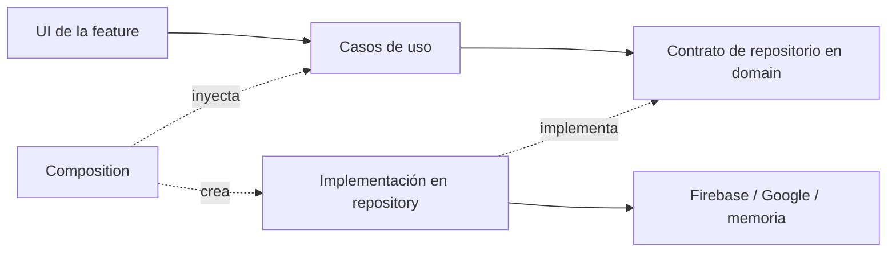

# Arquitectura por feature

La aplicación utiliza Clean Architecture dentro de cada feature. Las dos features actuales son `auth` y `counter`.

```text
src/
  app/                         Adaptadores de rutas de Expo Router
  composition/
    AppProviders.tsx           Conecta implementaciones, casos de uso y UI
  features/
    auth/
      domain/                  AuthUser, AuthRepository, validación
      use-cases/               Email, registro, Google, sesión, disponibilidad y logout
      repository/              Firebase, Google y mapeo de usuarios
      ui/                      Login, registro, provider, inicialización y mensajes
    counter/
      domain/                  Contrato CounterRepository
      use-cases/               Consultar, incrementar y reiniciar
      repository/              Contador en memoria por instancia
      ui/                      Pantalla autenticada y controles
```



Los casos de uso reciben el contrato de repositorio como argumento; no crean SDK, no conocen React y no importan la implementación. El dominio contiene modelos propios: `AuthUser` expone `id`, `email` y `displayName`, sin métodos ni tokens de Firebase. El repositorio traduce la respuesta nativa a este modelo.

La UI recibe los casos de uso y gestiona únicamente presentación y estado de pantalla. `AuthProvider` observa la sesión mediante un caso de uso y libera el listener al desmontarse o reintentar. `CounterFeature` crea un repositorio por pantalla, de forma que el valor se reinicia al volver a montar la feature; no se comparte entre sesiones.

`src/app/` declara rutas y guards. Login e índice son adaptadores de una línea a la UI o a su composición. Toda importación de repositorios concretos desde otra capa se concentra en `src/composition/`.

Para añadir una feature, crea sus contratos y modelos en `domain/`, sus operaciones en `use-cases/`, implementaciones en `repository/` y pantallas/hooks en `ui/`. Conecta las implementaciones en composition y registra la ruta en `src/app/`. No accedas a un repositorio o SDK desde una pantalla.

`npm test` verifica reglas de dependencia con el AST de TypeScript, además de probar casos de uso con repositorios falsos. Estas pruebas cubren validación, cancelación, logout, sesión, mapeo de usuarios y aislamiento del contador. Las pruebas nativas con cuentas reales siguen siendo necesarias para confirmar el login en Firebase.
